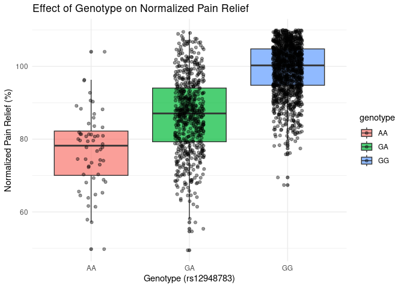
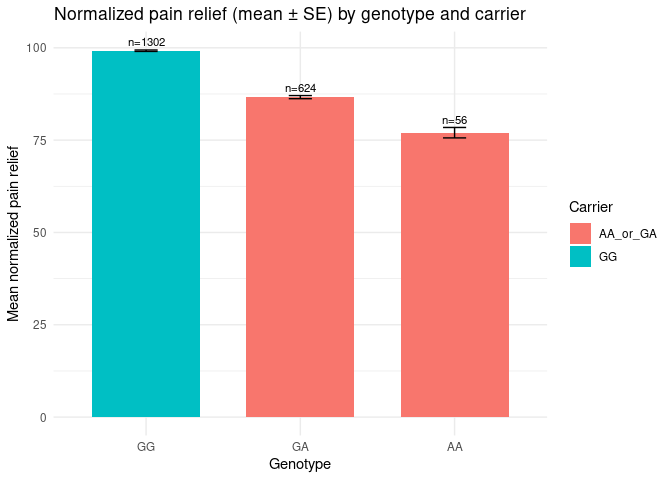

Opioid use in European Cancer Patients
================
Matthew Siddoway
2025-12-06

- [ABSTRACT](#abstract)
- [BACKGROUND](#background)
  - [Questions](#questions)
  - [Hypothesis](#hypothesis)
  - [Prediction](#prediction)
- [METHODS](#methods)
- [DISCUSSION](#discussion)
  - [Interpretation of boxplot](#interpretation-of-boxplot)
  - [Interpretation of the linear
    model](#interpretation-of-the-linear-model)
  - [Interpretation of the barplot](#interpretation-of-the-barplot)
- [CONCLUSION](#conclusion)
  - [Limitations](#limitations)
- [REFERENCES](#references)

# ABSTRACT

Opioid responsiveness varies widely among cancer patients, and growing
evidence suggests that genetic factors contribute to differences in
analgesic efficacy (Galvan et al., 2011; Klepstad et al., 2011). This
study investigates whether variation at the rs12948783 genetic locus—as
well as phenotypic variables such as sex and country of
origin—influences normalized pain relief among European cancer patients
treated with opioid medications. Using a simulated dataset modeled on
the findings of Galvan et al. (2011), we conducted linear modeling and
graphical analyses to evaluate associations between genotype and pain
outcomes as well as differences in sex as well as country of origin. Our
results show statistically significant differences between different
genotypes, suggesting that genetic background may play a meaningful role
in modulating opioid response. However, we found no statistical
significance in differences between sex or country of origin. These
findings support the growing movement toward personalized,
genotype-informed pain management for cancer patients.

# BACKGROUND

Effective pain management in cancer patients remains a critical
challenge, as individuals often exhibit substantial variability in their
responses to opioid therapy. This variability can result from a
combination of physiological, environmental, and genetic factors that
influence both opioid metabolism and receptor function. Recent
pharmacogenetic studies have emphasized the role of single nucleotide
polymorphisms (SNPs) in genes associated with opioid signaling pathways
in determining the efficacy and dosage requirements of pain treatment.
One influential study by Galvan et al. (2011) was conducted by the
European Pharmacogenetic Opioid Study (EPOS). This study identified
multiple genetic loci that modulate opioid therapy response in cancer
patients across Europe. Their findings indicated that variants such as
rs12948783 were significantly associated with differences in pain relief
and opioid dose requirements, suggesting that specific genetic profiles
can affect a patient’s analgesic sensitivity. These results highlight
the importance of integrating genetic screening into clinical pain
management to optimize therapeutic outcomes and minimize adverse
effects. Based on this evidence, the present study seeks to investigate
how genetic and phenotypic factors influence pain management outcomes
among European cancer patients treated with opioids. Understanding these
genetic and demographic determinants of opioid efficacy may provide
valuable insights for the development of personalized pain management
strategies, ultimately improving quality of life for cancer patients
undergoing treatment. \# STUDY QUESTION and HYPOTHESIS

## Questions

What effect does genetics and phenotypes have on pain management among
European cancer patients who have been treated with opioids?

## Hypothesis

Genetic variation in genetic locus rs12948783 significantly affect pain
relief and opioid requirements.

## Prediction

There will be certain phenotypes and genetics that correspond to greater
normalized pain relief with opioid therapy.

# METHODS

Due to privacy laws, the actual data from the study was not able to be
obtained. However, we were able to simulate data that provided
information in line with the findings reported in Galvan et al. (2011).
Data included genotype at rs12948783, carrier status of the minor
allele, normalized pain relief, sex, and country of origin. After
importing the dataset into R, boxplots were created to visualize pain
relief differences across genotypes, while barplots summarized mean ±
standard error pain relief values by genotype and carrier status.

In Figure 1, a boxplot was generated to visualize the differences in
normalized pain response with respect to the three different genotypes
that were observed in the study. In Figure 2, a barplot was utilized to
show the difference between the means with standard error between the
different genotypes. To assess the relationship between the factors
genotype, sex, and country, a linear regression model was utilized to
determine the statistical significance of the variables.

``` r
library(readr)
library(ggplot2)

data <- read_csv("epos_style_rs12948783_simulated_large.csv")
```

    ## Rows: 1982 Columns: 6
    ## ── Column specification ────────────────────────────────────────────────────────
    ## Delimiter: ","
    ## chr (4): genotype, carrier, sex, country
    ## dbl (2): id, norm_pain_relief
    ## 
    ## ℹ Use `spec()` to retrieve the full column specification for this data.
    ## ℹ Specify the column types or set `show_col_types = FALSE` to quiet this message.

``` r
data$genotype <- as.factor(data$genotype)
data$sex <- as.factor(data$sex)
data$country <- as.factor(data$country)

sample_size <- min(5000, nrow(data))

model_data <- data[sample(nrow(data), sample_size), ]
model <- lm(norm_pain_relief ~ genotype + sex + country, data = model_data)
summary(model)
```

    ## 
    ## Call:
    ## lm(formula = norm_pain_relief ~ genotype + sex + country, data = model_data)
    ## 
    ## Residuals:
    ##     Min      1Q  Median      3Q     Max 
    ## -36.760  -5.172   0.919   5.818  26.756 
    ## 
    ## Coefficients:
    ##             Estimate Std. Error t value Pr(>|t|)    
    ## (Intercept) 76.75153    1.18604  64.712  < 2e-16 ***
    ## genotypeGA   9.63566    1.17005   8.235 3.22e-16 ***
    ## genotypeGG  22.19112    1.14459  19.388  < 2e-16 ***
    ## sexMale      0.00591    0.37752   0.016    0.988    
    ## countryGB    0.49204    0.50958   0.966    0.334    
    ## countryIT   -0.14456    0.57632  -0.251    0.802    
    ## countryNO    0.55745    0.52729   1.057    0.291    
    ## ---
    ## Signif. codes:  0 '***' 0.001 '**' 0.01 '*' 0.05 '.' 0.1 ' ' 1
    ## 
    ## Residual standard error: 8.385 on 1975 degrees of freedom
    ## Multiple R-squared:  0.3792, Adjusted R-squared:  0.3773 
    ## F-statistic:   201 on 6 and 1975 DF,  p-value: < 2.2e-16

``` r
plot_data <- data[sample(nrow(data), sample_size), ]

ggplot(plot_data, aes(x = genotype, y = norm_pain_relief, fill = genotype)) +
  geom_boxplot(alpha = 0.7) +
  geom_jitter(width = 0.15, alpha = 0.4) +
  labs(
    title = "Effect of Genotype on Normalized Pain Relief",
    x = "Genotype (rs12948783)",
    y = "Normalized Pain Relief (%)"
  ) +
  theme_minimal()
```

<!-- -->

``` r
suppressPackageStartupMessages({ library(readr); library(dplyr); library(ggplot2) })


dat <- read_csv("epos_style_rs12948783_simulated_large.csv")
```

    ## Rows: 1982 Columns: 6
    ## ── Column specification ────────────────────────────────────────────────────────
    ## Delimiter: ","
    ## chr (4): genotype, carrier, sex, country
    ## dbl (2): id, norm_pain_relief
    ## 
    ## ℹ Use `spec()` to retrieve the full column specification for this data.
    ## ℹ Specify the column types or set `show_col_types = FALSE` to quiet this message.

``` r
names(dat) <- make.names(trimws(names(dat)), unique = TRUE)

stopifnot(all(c("genotype","norm_pain_relief","carrier") %in% names(dat)))
dat$genotype <- as.factor(dat$genotype)
dat$carrier  <- as.factor(dat$carrier)
dat$pain     <- suppressWarnings(as.numeric(dat$norm_pain_relief))
dat <- dat[is.finite(dat$pain), , drop = FALSE]

summ <- dat %>%
  dplyr::group_by(genotype, carrier) %>%
  dplyr::summarise(
    n  = dplyr::n(),
    mn = mean(pain, na.rm = TRUE),
    sd = sd(pain,   na.rm = TRUE),
    se = ifelse(n > 1, sd / sqrt(n), 0),
    .groups = "drop"
  )

geno_order <- summ %>%
  dplyr::group_by(genotype) %>%
  dplyr::summarise(overall = mean(mn, na.rm = TRUE), .groups = "drop") %>%
  dplyr::arrange(dplyr::desc(overall)) %>%
  dplyr::pull(genotype) %>%
  as.character()
summ$genotype <- factor(summ$genotype, levels = geno_order)

dodge_w <- 0.75
p <- ggplot(summ, aes(x = genotype, y = mn, fill = carrier)) +
  geom_col(position = position_dodge(width = dodge_w), width = 0.7) +
  geom_errorbar(aes(ymin = mn - se, ymax = mn + se),
                position = position_dodge(width = dodge_w), width = 0.15) +
  geom_text(aes(label = paste0("n=", n), y = mn + se),
            position = position_dodge(width = dodge_w),
            vjust = -0.4, size = 3) +
  labs(
    title = "Normalized pain relief (mean ± SE) by genotype and carrier",
    x = "Genotype", y = "Mean normalized pain relief", fill = "Carrier"
  ) +
  theme_minimal()
print(p)
```

<!-- -->

# DISCUSSION

The present study demonstrates that genetic variation at rs12948783
influences normalized pain relief. These findings align with Galvan et
al., 2011 results showing that SNPs in opioid-related genes
significantly impact analgesic outcomes. Both the boxplots and barplots
indicate substantial differences in pain relief across genotypes and
carrier groups, with G-allele carriers generally exhibiting enhanced
opioid responsiveness, especially those who were homozygous for the G
allele. These results are consistent with prior observations that
certain alleles increase opioid receptor sensitivity or alter downstream
signaling pathways (Klepstad et al., 2011). We can also see that factors
like sex and country of origin have no statistical significance on
opioid responsiveness. Overall, these results reinforce the idea that
pharmacogenomic screening may be a valuable tool in optimizing opioid
prescribing and improving cancer pain management.

## Interpretation of boxplot

The boxplot reveals clear differences in the distribution of normalized
pain relief between rs12948783 genotypes. Those who had the G-allele
present at the rs12948783 locus were overall more receptive to opioids
and reported higher levels of normalized pain relief. Furthermore, those
who were homozygous for the G-allele experienced the highest levels of
normalized pain relief. This is consistent with the findings of Galvan
et al., 2011.

## Interpretation of the linear model

The linear model shows the significance of different factors. The model
shows very high statistical significance (p-value = 2e-16) of
differences in genotype having an effect on noramlized pain relief from
opioids. However, phenotypic factors like sex and country of origin were
shown to have no statistical significance.

## Interpretation of the barplot

The barplot shows that G-allele carriers consistently exhibited higher
mean normalized pain relief across all genotypes. Standard error bars
were relatively small, and sample sizes (n-values) were large,
indicating reliable mean estimates. This pattern mirrors patterns seen
in real pharmacogenomic studies, where G-allele carriers often
experience enhanced opioid sensitivity (Klepstad et al., 2011).

# CONCLUSION

This study supports the hypothesis that genetic factors influence opioid
treatment outcomes among European cancer patients. However, phenotypic
differences like sex and country of origin were not shown to have any
significant effect on normalized pain relief. Variation at the
rs12948783 locus appears to be meaningfully associated with pain relief,
with G-allele carriers showing superior analgesic response. Together,
these findings highlight the potential clinical value of incorporating
genetic information into pain management strategies and underscore the
need for continued research in personalized opioid therapy.

## Limitations

It is important to note that the data we utilized was simulated to match
outcomes of previous studies. It would be beneficial to conduct a new
study to obtain data, or obtain and utilize the data from the initial
study (Galvan et al., 2011).

This study also only focuses on European cancer patients. In order to
determine if country of origin is truly insignificant, it would be
important to gather data from other parts of the world and reevaluate
its significance in normalized pain relief.

# REFERENCES

Galvan, A., Skorpen, F., Klepstad, P., Fragoso, M., Ando, M., Nilsen,
T., … & Ciotti, P. (2011). Multiple loci modulate opioid therapy
response for cancer pain. Clinical Cancer Research, 17(13), 4581–4587.
<https://aacrjournals.org/clincancerres/article/17/13/4581/11924/Multiple-Loci-Modulate-Opioid-Therapy-Response-for>

Klepstad, P., Fladvad, T., Skorpen, F., et al. (2011). Influence of
genetic variability on opioid use for cancer pain: A European genetic
association study of 2294 cancer pain patients. Pain, 152(5), 1139–1145.
R Core Team. (2024). R: A language and environment for statistical
computing. R Foundation for Statistical
Computing.https://pubmed.ncbi.nlm.nih.gov/21398039/

ChatGPT. OpenAI, version Jan 2025. Used as a reference for functions
such as plot() and to correct syntax errors. Accessed 2025-12-06.
