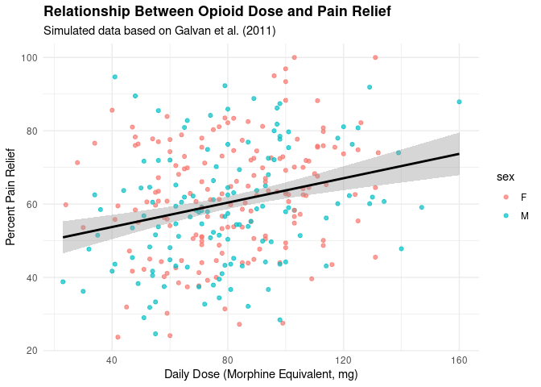

Opioid use in Cancer Patients
================
Matthew Siddoway
2025-10-30

- [ABSTRACT](#abstract)
- [BACKGROUND](#background)
- [STUDY QUESTION and HYPOTHESIS](#study-question-and-hypothesis)
  - [Questions](#questions)
  - [Hypothesis](#hypothesis)
- [METHODS](#methods)
  - [Generalized Linear Model](#generalized-linear-model)
- [DISCUSSION](#discussion)
  - [Interpretation of barplots](#interpretation-of-barplots)
  - [Interpretation of the generalized linear
    model](#interpretation-of-the-generalized-linear-model)
- [CONCLUSION](#conclusion)
- [REFERENCES](#references)

# ABSTRACT

# BACKGROUND

# STUDY QUESTION and HYPOTHESIS

## Questions

What effect does genetics and phenotypes have on pain management among
European cancer patients who have been treated with opioids?

## Hypothesis

Genetic variation in opioid receptor-related genes significantly affect
pain relief and opioid requirements. \## Prediction I predict that there
will be certain phenotypes and genetics that correspond to lesser pain
responses depending on the unique genetic makeup of each demographic.

# METHODS

``` r
library(ggplot2)
data <- read.csv("Opioid dataset.csv")
str(data)
```

    ## 'data.frame':    300 obs. of  11 variables:
    ##  $ patient_id                   : int  1 2 3 4 5 6 7 8 9 10 ...
    ##  $ age                          : int  73 63 49 77 42 55 73 53 57 45 ...
    ##  $ sex                          : chr  "M" "M" "M" "F" ...
    ##  $ opioid_type                  : chr  "Oxycodone" "Oxycodone" "Morphine" "Morphine" ...
    ##  $ daily_dose_mg_ME             : num  71 103 77 106 105 69 106 82 85 79 ...
    ##  $ baseline_pain_0_10           : num  6.2 6.8 6.6 6.4 6.5 6.5 6.4 8.1 5.7 6.1 ...
    ##  $ percent_pain_relief          : num  59.2 58.3 51.5 64.2 51.4 58.3 62.5 83.4 58.6 31.4 ...
    ##  $ responder_category           : chr  "Intermediate" "Intermediate" "Intermediate" "Intermediate" ...
    ##  $ rs12211463_minor_allele_count: int  0 0 0 0 0 0 0 0 1 0 ...
    ##  $ rs13421094_minor_allele_count: int  0 0 0 0 1 0 0 0 1 1 ...
    ##  $ rs10413396_minor_allele_count: int  1 0 0 0 1 0 1 1 0 1 ...

``` r
model <- lm(percent_pain_relief ~ daily_dose_mg_ME + age + sex +
               rs12211463_minor_allele_count +
               rs13421094_minor_allele_count +
               rs10413396_minor_allele_count,
             data = data)

summary(model)
```

    ## 
    ## Call:
    ## lm(formula = percent_pain_relief ~ daily_dose_mg_ME + age + sex + 
    ##     rs12211463_minor_allele_count + rs13421094_minor_allele_count + 
    ##     rs10413396_minor_allele_count, data = data)
    ## 
    ## Residuals:
    ##     Min      1Q  Median      3Q     Max 
    ## -40.917 -11.208   0.088  11.099  36.474 
    ## 
    ## Coefficients:
    ##                               Estimate Std. Error t value Pr(>|t|)    
    ## (Intercept)                   59.01774    4.82209  12.239  < 2e-16 ***
    ## daily_dose_mg_ME               0.15281    0.03512   4.352 1.87e-05 ***
    ## age                           -0.14402    0.06015  -2.394   0.0173 *  
    ## sexM                          -2.36487    1.75059  -1.351   0.1778    
    ## rs12211463_minor_allele_count -3.06144    1.49751  -2.044   0.0418 *  
    ## rs13421094_minor_allele_count  1.94082    1.49084   1.302   0.1940    
    ## rs10413396_minor_allele_count -2.17598    1.45668  -1.494   0.1363    
    ## ---
    ## Signif. codes:  0 '***' 0.001 '**' 0.01 '*' 0.05 '.' 0.1 ' ' 1
    ## 
    ## Residual standard error: 14.94 on 293 degrees of freedom
    ## Multiple R-squared:  0.1217, Adjusted R-squared:  0.1037 
    ## F-statistic: 6.768 on 6 and 293 DF,  p-value: 9.867e-07

``` r
ggplot(data, aes(x = daily_dose_mg_ME, y = percent_pain_relief, color = sex)) +
  geom_point(alpha = 0.7) +
  geom_smooth(method = "lm", se = TRUE, color = "black") +
  labs(
    title = "Relationship Between Opioid Dose and Pain Relief",
    subtitle = "Simulated data based on Galvan et al. (2011)",
    x = "Daily Dose (Morphine Equivalent, mg)",
    y = "Percent Pain Relief"
  ) +
  theme_minimal() +
  theme(plot.title = element_text(face = "bold"))
```

    ## `geom_smooth()` using formula = 'y ~ x'

<!-- -->
\## Barplots

## Generalized Linear Model

# DISCUSSION

## Interpretation of barplots

## Interpretation of the generalized linear model

# CONCLUSION

# REFERENCES

1.  Komar N, Langevin S, Hinten S, Nemeth N, Edwards E, Hettler D, Davis
    B, Bowen R, Bunning M. Experimental infection of North American
    birds with the New York 1999 strain of West Nile virus. Emerg Infect
    Dis. 2003 Mar;9(3):311-22. <https://doi.org/10.3201/eid0903.020628>

2.  ChatGPT. OpenAI, version Jan 2025. Used as a reference for functions
    such as plot() and to correct syntax errors. Accessed 2025-10-30.
